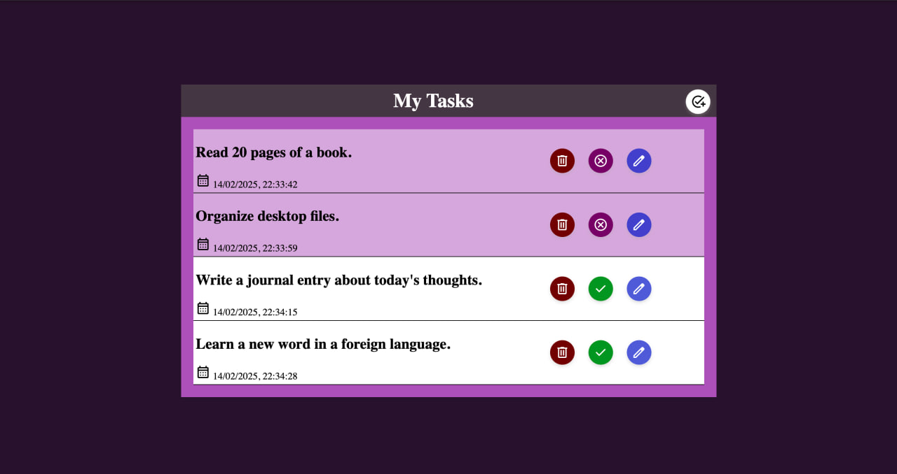

# To-Do List Manager

## Description
The **To-Do List Manager** is a simple task management application built using **HTML, CSS, and JavaScript**. It allows users to create, update, delete, and mark tasks as completed while persisting data using **localStorage**.

## Features
- **Add Tasks**: Users can add new tasks with a title and an automatically assigned timestamp.
- **Edit Tasks**: Users can rename existing tasks.
- **Delete Tasks**: Users can remove tasks from the list.
- **Mark Tasks as Done**: Users can toggle task completion status.
- **Persistent Storage**: Tasks are saved in `localStorage` and remain available after page reloads.

## Technologies Used
- JavaScript (for task management logic)
- HTML (for structure)
- CSS (for styling)
- localStorage (for data persistence)

## How to Use
1. Open the project in a web browser.
2. Click the **Add Task** button to create a new task.
3. Click the **Edit** button to modify a task title.
4. Click the **Checkmark** button to mark a task as done.
5. Click the **Delete** button to remove a task.
6. Tasks persist even after refreshing the page.

## Demo
[Live Demo](https://abdulkanawati.github.io/todo-list-manager/)

## Screenshot


## Code Overview
### Main Functions
```javascript
function getTaskFromStorage() {
    try {
        let retrievedTasks = JSON.parse(localStorage.getItem("myTasks"));
        tasks = retrievedTasks ?? [];
    } catch (error) {
        console.error("Failed to retrieve tasks:", error);
        tasks = [];
    }
}

function storeTasks() {
    try {
        let tasksString = JSON.stringify(tasks);
        localStorage.setItem("myTasks", tasksString);
    } catch (error) {
        console.error("Failed to store tasks:", error);
    }
}
```

## Installation & Setup
1. Clone this repository:
   ```bash
   git clone https://github.com/your-username/todo-list-manager.git
   ```
2. Open `index.html` in a browser.
3. Start managing your tasks!

## Contributing
Contributions are welcome! Feel free to fork this project and submit pull requests.

## License
This project is licensed under the [MIT License](LICENSE).

---

**Happy Coding!** 🚀


